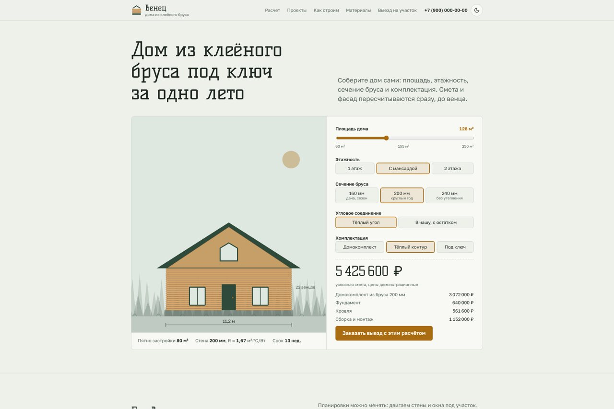
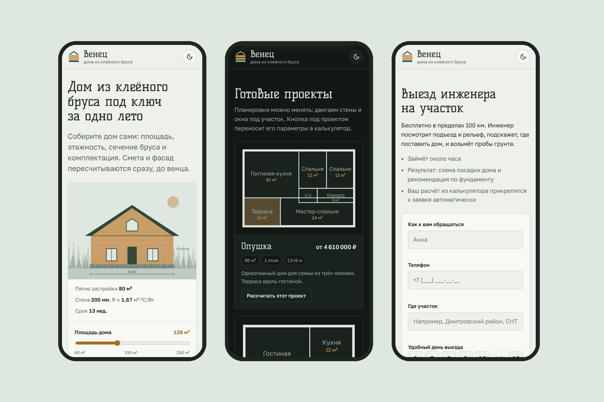
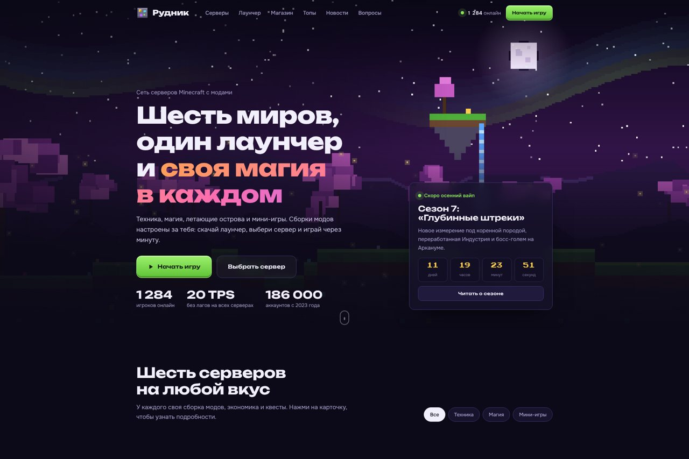
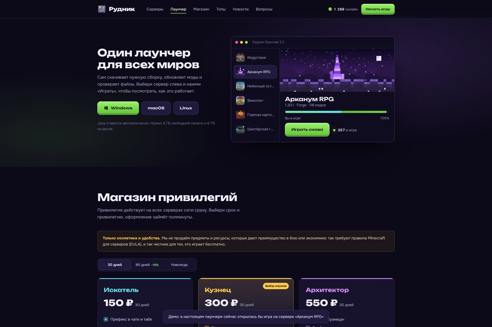
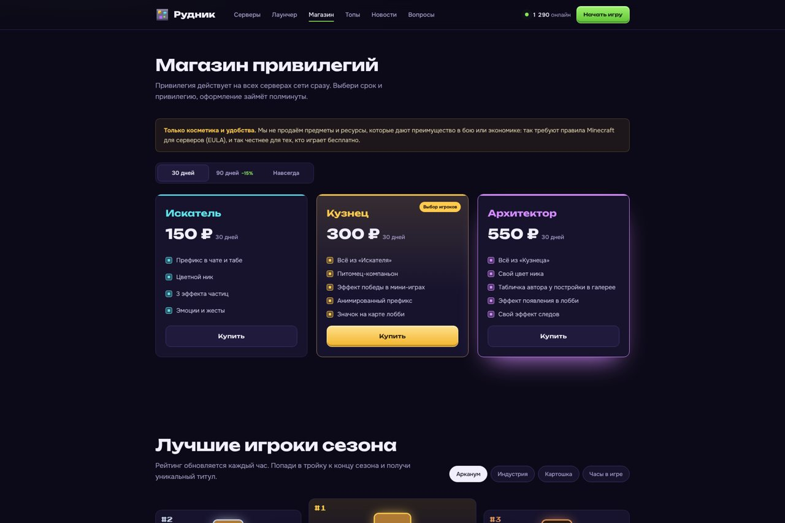

# Демо-сайты

Два демо-сайта с интерактивом, адаптивом под телефоны и светлой и тёмной темой. Каждый сайт — один HTML-файл без фреймворков и сборки, шрифты встроены.

Смотреть онлайн: https://ttcux1.github.io/web-demos/

## «Венец» — строительная компания

[Открыть сайт](https://ttcux1.github.io/web-demos/venec/)

- Калькулятор дома из клеёного бруса: площадь, этажность, сечение бруса, угловое соединение, комплектация
- Смета, срок и теплосопротивление стены считаются сразу, фасад перерисовывается в SVG
- Готовые проекты с планировками; кнопка переносит проект в калькулятор
- Этапы стройки, сравнение материалов, вопросы и ответы
- Запись на выезд: маска телефона, выбор дня, проверка полей, расчёт прикладывается к заявке

## «Рудник» — сеть серверов Minecraft

[Открыть сайт](https://ttcux1.github.io/web-demos/rudnik/)

- Живой пиксельный пейзаж на canvas: параллакс за курсором, северное сияние, летающий остров с водопадом, светлячки
- Шесть серверов с уникальными пиксельными обложками, фильтр по типу, наклон карточек и окно с подробностями
- Макет лаунчера: выбор сервера, загрузка модов с прогрессом и запуском
- Магазин привилегий: срок со скользящим переключателем, оформление в окне, проверка ника, промокод, превью ника в чате
- Топы с пьедесталом, новости с подгрузкой, отсчёт до вайпа, счётчики сообщества
- Анимации кнопок: блик, свечение, волна от нажатия; учитывается настройка «уменьшить движение»

## Технологии

HTML, CSS, JavaScript без библиотек. Canvas и SVG для графики, CSS-переменные для тем, доступность с клавиатуры.

## Авторство

© 2026 TTcux — [github.com/TTcux1](https://github.com/TTcux1). Все права защищены. Компании, сервер, цены и контакты на сайтах вымышленные. «Рудник» не связан с Mojang и Microsoft.
